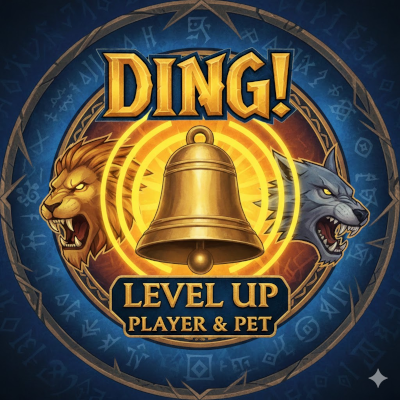

# Ding! Level Up (Player & Pet)

A lightweight, reliable World of Warcraft: TBC Classic addon that automatically announces level-up milestones for both **Players** and **Pets** to Guild Chat.

## 🚀 Features

* **Player Dings:** Instantly announces your character's level-ups.
* **Pet Dings:** Specifically designed for Hunters to announce when their pets gain a level.
* **Smart Logic:** * Uses a 0.5s synchronization delay for pets to ensure the correct level is reported.
    * GUID verification prevents "false dings" when summoning or swapping pets.
* **Guild Awareness:** Automatically falls back to a local system message if you aren't currently in a guild.
* **User Friendly:** Color-coded chat feedback and easy-to-use slash commands.

---

## 🛠 Installation

1. Download the latest release.
2. Extract the `Ding_Level_Up` folder.
3. Move the folder to your World of Warcraft directory:
   `_classic_era_/Interface/AddOns/`
4. Restart your game or reload your UI (`/reload`).

---

## ⌨️ Slash Commands

Use `/ding` to manage your settings:

| Command | Action |
| :--- | :--- |
| `/ding player` | Toggle Player level-up announcements on/off |
| `/ding pet` | Toggle Pet level-up announcements on/off |
| `/ding test` | Simulate an announcement to verify it's working |
| `/ding` | Display the help menu |

---

## 📝 Technical Details

* **Interface:** 20505 (TBC Classic)
* **Events Handled:** `PLAYER_LEVEL_UP`, `UNIT_LEVEL`, `UNIT_PET`, `ADDON_LOADED`
* **Saved Variables:** `DingLevelUpSettings` (Per-Character)

---

## 👤 Author

**Frightware** *Built for the TBC Classic Community.*